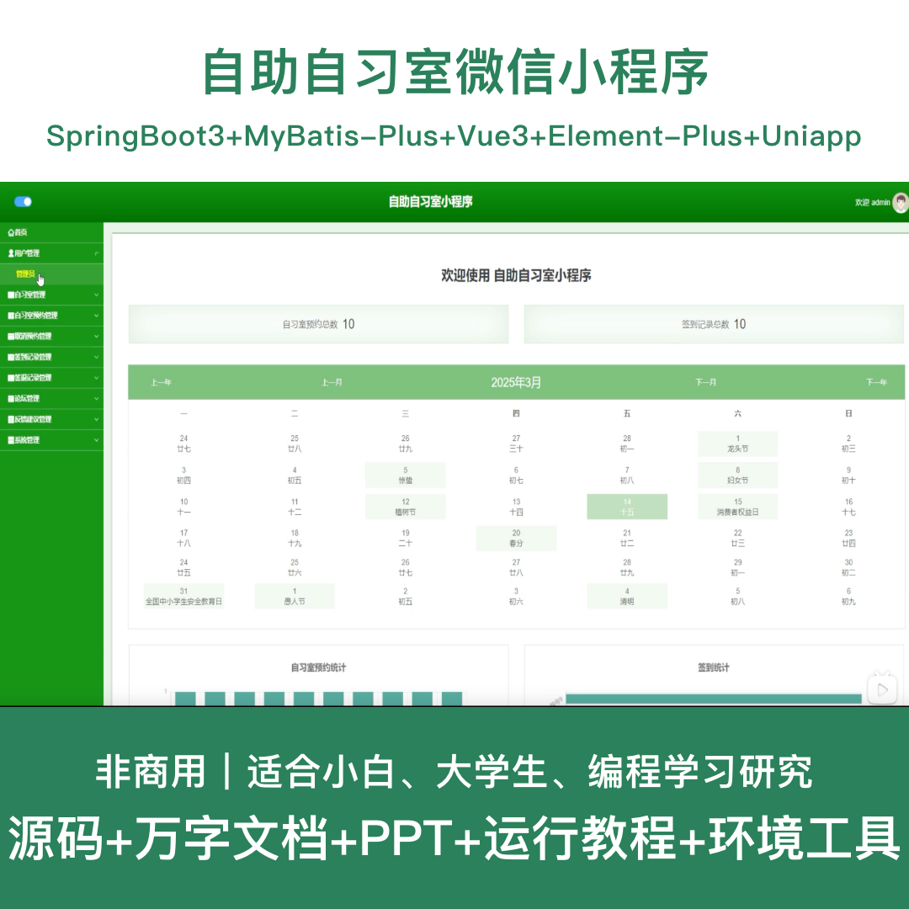
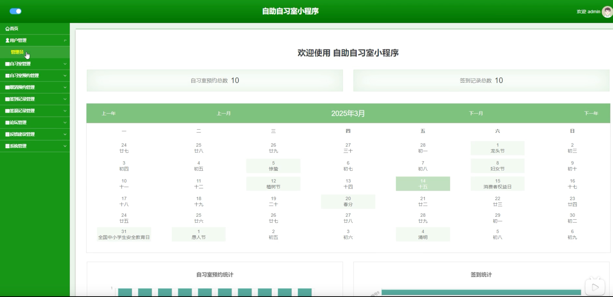
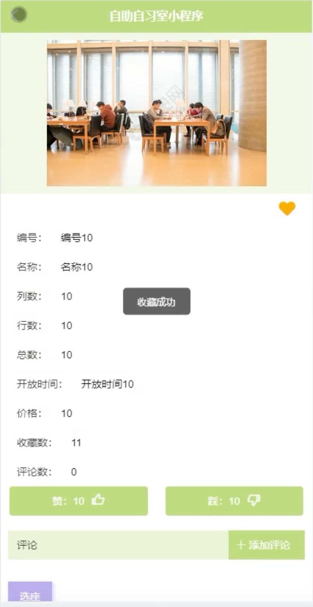
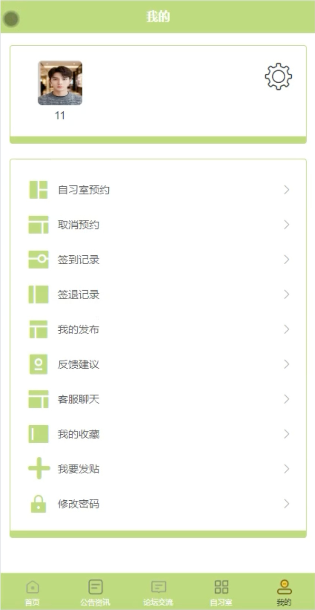
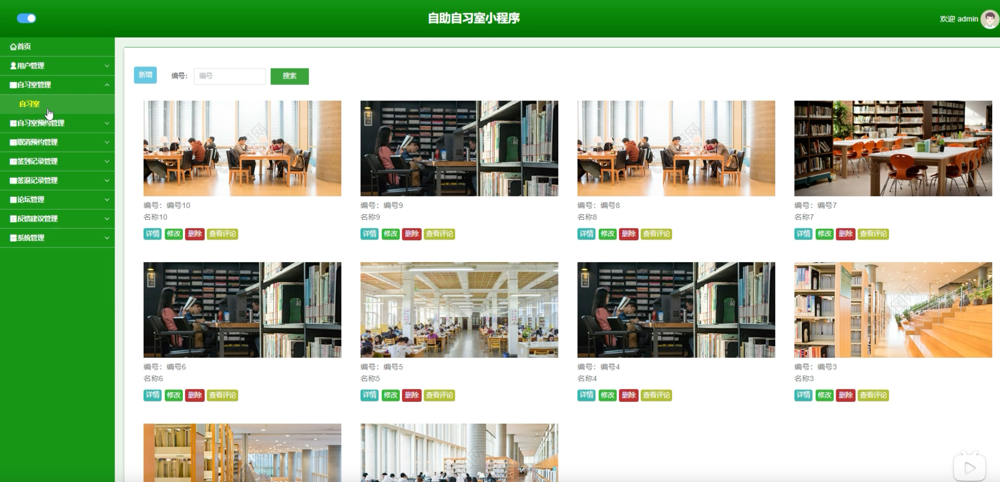
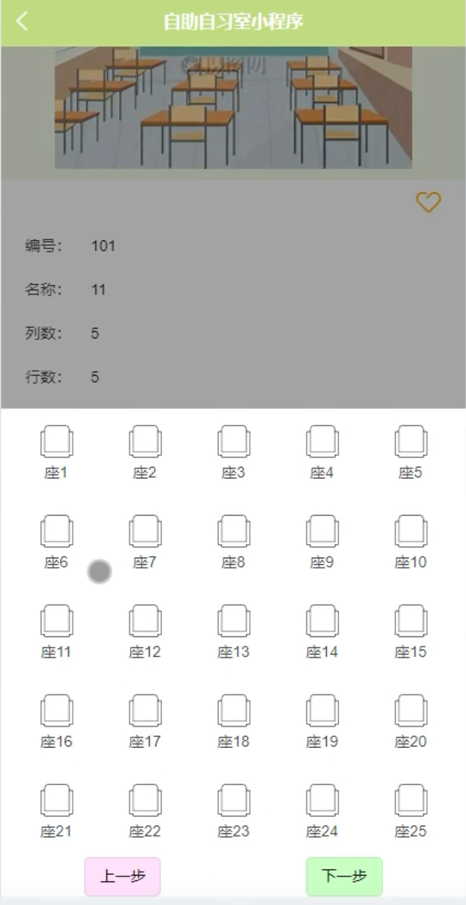
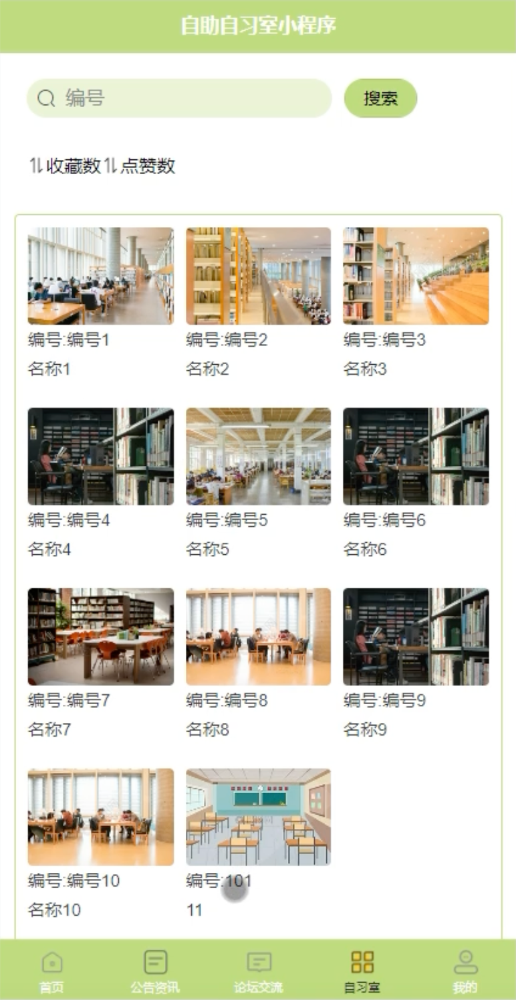

# mpweixinA230D
mpweixinA230D自助自习室微信小程序+LW+PPT
 
## 源码问题查看主页咨询

### 一、关键词
自助自习室系统、自习室管理系统、座位预约系统、学习空间系统、图书馆座位系统

### 二、作品包含
源码+数据库+万字设计文档+PPT+全套环境和工具资源+本地部署教程

### 三、项目技术
前端技术： Html、Css、Js、Vue3.2、Element-Plus、uniapp
后端技术：Java、SpringBoot3.3.0、MyBatis-Plus

### 四、运行环境（以下版本亲测，其他版本兼容性请自行测试）
开发工具：IDEA/eclipse + VSCODE + HBuilder X + 微信开发者工具

数据库：MySQL 8.0+

数据库管理工具：Navicat10以上版本

环境配置软件： JDK17 + Maven3.6+

前端Nodejs：16+

浏览器：谷歌浏览器

### 五、项目介绍
项目编号：mpweixinA230D

基于微信小程序的自助自习室系统，方便用户随时随地预约座位，提升自习室运营管理效率和用户学习体验。

角色：管理员、用户

用户功能：注册登录、浏览自习室、座位预约、预约管理、订单管理、意见反馈、个人中心。

管理员功能：登录、用户管理、自习室管理、座位管理、预约管理、订单管理、意见反馈管理、系统管理。

数据库表：18张

### 六、运行截图

